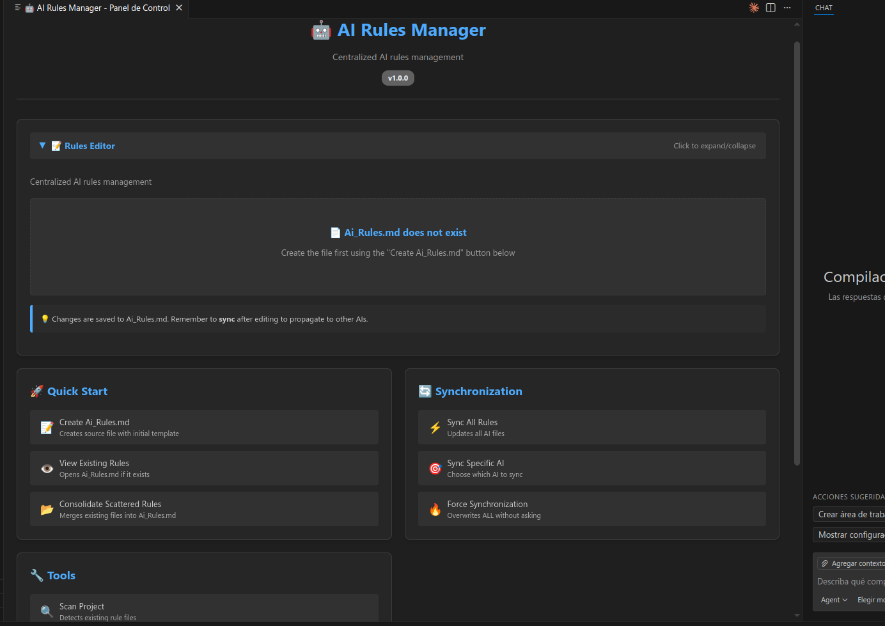
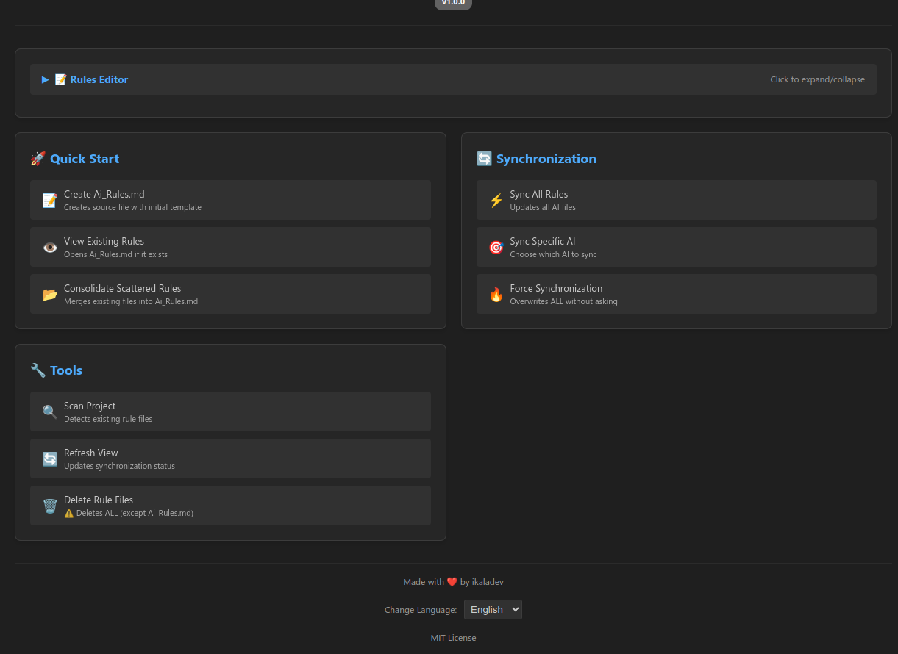
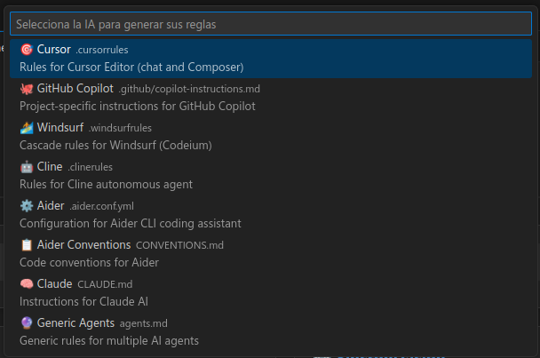
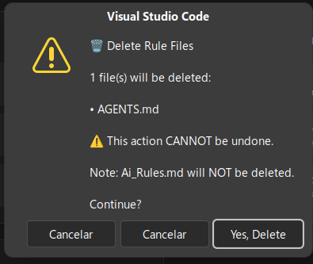

# 🤖 AI Rules Manager

**Gestión centralizada de reglas para múltiples herramientas de IA - Una única fuente de verdad para todos tus asistentes de IA**

[](https://marketplace.visualstudio.com/vscode)
[](https://opensource.org/licenses/MIT)
[](https://github.com/ikaladev/ai-rules)

> **English**: [README.md](README.md)

---

## 🎯 El Problema

El desarrollo moderno utiliza múltiples herramientas de IA, cada una con sus propios archivos de configuración:
- **Cursor** con `.cursorrules`
- **GitHub Copilot** con `.github/copilot-instructions.md`
- **Windsurf** con `.windsurfrules`
- **Cline** con `.clinerules`
- **Aider** con `.aider.conf.yml`
- **Claude** con `CLAUDE.md`
- Y más...

Esto crea:
- ❌ **Duplicación de reglas** entre archivos
- ❌ **Desincronización** entre herramientas
- ❌ **Pesadilla de mantenimiento** en proyectos grandes

---

## ✅ La Solución

**AI Rules Manager** proporciona:

✨ **Fuente Única de Verdad**: Define reglas una vez en `Ai_Rules.md`  
✨ **Auto-Detección**: Encuentra automáticamente archivos de reglas existentes  
✨ **Sincronización Inteligente**: Sincroniza con una o todas las herramientas de IA  
✨ **Panel de Control Visual**: Gestiona todo desde una interfaz hermosa  
✨ **Plantillas de Reglas**: Inserta reglas predefinidas para escenarios comunes  
✨ **Multi-idioma**: Soporte completo para Inglés y Español

---

## 🚀 Características Principales

### 🎨 Panel de Control Visual
- **Interfaz web** integrada en VS Code
- **Acciones de un clic** para todas las operaciones
- **Editor integrado** para ediciones rápidas de reglas
- **Secciones colapsables** para un espacio de trabajo limpio
- **Selector de idioma** (Inglés/Español)

### 📚 Sistema de Plantillas de Reglas
- **Plantillas predefinidas** organizadas por categoría:
  - General (Código Limpio, Rendimiento, etc.)
  - Frontend (React, CSS, Accesibilidad)
  - Backend (APIs REST, Bases de Datos, Autenticación)
  - Testing (Unitarias, Integración, E2E)
- **Contenido bilingüe** (Inglés y Español)
- **Inserción rápida** con vista previa

### 🔍 Escaneo Inteligente
- Detecta automáticamente archivos de reglas en tu proyecto
- Identifica qué herramienta de IA usa cada archivo
- Muestra estado de sincronización (✅ sincronizado, ⚠️ desactualizado, ❌ ausente)

### 📊 Vista en Sidebar
- TreeView integrado en el Explorer
- Iconos visuales para cada herramienta de IA
- Click para abrir archivos
- Indicadores de estado en tiempo real

### 🔄 Sincronización Automática
- **Hard sync** (copia completa) del contenido
- **Encabezados auto-generados** en archivos de destino
- **Confirmación** antes de sobrescribir
- **Seguimiento de metadatos** en `.vscode/ai-rules.json`

### 🌐 Soporte Multi-idioma
- **Auto-detección** del idioma de VS Code
- **Selector manual** en el footer del Panel de Control
- **UI localizada** (todo el texto se traduce instantáneamente)
- **Plantillas localizadas** (se insertan en el idioma seleccionado)

---

## 📦 Instalación

### Desde VS Code Marketplace (Recomendado)
1. Abre VS Code
2. Ve a Extensiones (`Ctrl+Shift+X` o `Cmd+Shift+X`)
3. Busca **"AI Rules Manager"**
4. Haz clic en **Install**

### Desde el Código Fuente (Desarrollo)
```bash
git clone https://github.com/ikaladev/ai-rules.git
cd ai-rules-manager
npm install
npm run compile
```

Luego presiona `F5` para abrir en Extension Development Host.

---

## 🎯 Inicio Rápido

### Método 1: Usando el Panel de Control (Recomendado)

1. **Abrir Panel de Control**
   ```
   Cmd/Ctrl + Shift + P → AI Rules: Abrir Panel de Control
   ```

2. **Crear archivo fuente**
   - Haz clic en el botón **"Crear Ai_Rules.md"**
   - O haz clic en **"Ver Reglas Existentes"** si el archivo ya existe

3. **Editar tus reglas**
   - Usa el editor integrado en el panel, o
   - Edita `Ai_Rules.md` directamente en tu editor

4. **Insertar plantillas** (Opcional)
   - Haz clic en **"📚 Insertar Plantilla"**
   - Elige categoría (General, Frontend, Backend, Testing)
   - Selecciona plantilla
   - El contenido se inserta en la posición del cursor

5. **Sincronizar**
   - Haz clic en **"Sincronizar Todas las Reglas"** para actualizar todas las herramientas de IA
   - O **"Sincronizar IA Específica"** para herramientas individuales

### Método 2: Usando la Paleta de Comandos

1. **Crear archivo fuente**
   ```
   Cmd/Ctrl + Shift + P → AI Rules: Crear Ai_Rules.md
   ```

2. **Editar tus reglas** en `Ai_Rules.md`:
   ```markdown
   # 🤖 Reglas de IA

   ## Estilo de Código
   - Usar TypeScript
   - Documentar con JSDoc
   - Preferir código limpio

   ## Tech Stack
   - Node.js + TypeScript
   - VS Code
   - Git
   ```

3. **Sincronizar**
   ```
   Cmd/Ctrl + Shift + P → AI Rules: Sincronizar todas las reglas
   ```

✨ **¡Listo!** Tus reglas ahora están en:
- `.cursorrules`
- `.github/copilot-instructions.md`
- `.windsurfrules`
- `.clinerules`
- Y todos los demás...

---

## 🗂️ Herramientas de IA Soportadas

| Herramienta de IA | Archivo Esperado | Descripción |
|-------------------|------------------|-------------|
| 🎯 **Cursor** | `.cursorrules` | Reglas para Cursor Editor (chat y Composer) |
| 🐙 **GitHub Copilot** | `.github/copilot-instructions.md` | Instrucciones específicas del proyecto |
| 🏄 **Windsurf** | `.windsurfrules` | Reglas Cascade para Windsurf (Codeium) |
| 🤖 **Cline** | `.clinerules` | Reglas para el agente autónomo Cline |
| ⚙️ **Aider** | `.aider.conf.yml` | Configuración para Aider CLI |
| 📋 **Aider Conventions** | `CONVENTIONS.md` | Convenciones de código para Aider |
| 🧠 **Claude** | `CLAUDE.md` | Instrucciones para Claude AI |
| 🔮 **Agentes Genéricos** | `agents.md` | Reglas genéricas para múltiples agentes |

---

## 📸 Capturas de Pantalla

### Panel de Control
*Hermosa UI con glassmorphism con todas las acciones en un solo lugar*



### Editor Integrado
*Edita Ai_Rules.md sin salir del panel*



### Selector de Plantillas
*Inserta reglas predefinidas con un clic*



### TreeView en Sidebar
*Ve el estado de sincronización de un vistazo*



---

## ⚙️ Cómo Funciona

### 1. Archivo Fuente
`Ai_Rules.md` es tu **única fuente de verdad**. Todas las reglas se definen aquí.

### 2. Auto-Detección
La extensión escanea tu workspace y detecta:
- Si existe `Ai_Rules.md`
- Qué archivos de reglas ya existen
- Si están sincronizados o desactualizados

### 3. Sincronización
Al sincronizar:
1. Lee el contenido de `Ai_Rules.md`
2. Calcula hash SHA-256 del contenido
3. Genera archivos específicos para cada IA con encabezado auto-generado
4. Guarda metadata en `.vscode/ai-rules.json`

### 4. Seguimiento de Estado
Compara hashes para determinar si los archivos están:
- ✅ **Sincronizados**: Hash coincide
- ⚠️ **Desactualizados**: Hash diferente
- ❌ **Ausentes**: Archivo no existe

---

## 🛠️ Comandos Disponibles

Todos los comandos accesibles vía:
- **Panel de Control** (recomendado)
- **Paleta de Comandos** (`Cmd/Ctrl + Shift + P`)
- Menú contextual del **TreeView**

| Comando | Descripción |
|---------|-------------|
| `AI Rules: Abrir Panel de Control` | Abre el panel de control visual |
| `AI Rules: Crear Ai_Rules.md` | Crea archivo fuente con plantilla |
| `AI Rules: Ver reglas` | Abre Ai_Rules.md si existe |
| `AI Rules: Consolidar Reglas Dispersas` | Fusiona archivos existentes en Ai_Rules.md |
| `AI Rules: Sincronizar todas las reglas` | Actualiza todos los archivos de herramientas de IA |
| `AI Rules: Generar reglas para IA específica` | Elige qué IA sincronizar |
| `AI Rules: Forzar Sincronización` | Sobrescribe TODO sin preguntar |
| `AI Rules: Escanear proyecto` | Detecta archivos de reglas existentes |
| `AI Rules: Refrescar vista` | Actualiza estado del TreeView |
| `AI Rules: Eliminar Todos los Archivos de Reglas` | Elimina todos los archivos de IA (no Ai_Rules.md) |

---

## 📚 Sistema de Plantillas

### Categorías

**📋 General**
- Reglas Básicas (nomenclatura, funciones, arquitectura)
- Principios de Código Limpio
- Optimización de rendimiento

**🎨 Frontend**
- Mejores prácticas React/Next.js
- Guías de CSS/Estilos
- Reglas de Accesibilidad (a11y)

**⚙️ Backend**
- Diseño de API REST
- Gestión de bases de datos
- Autenticación/Autorización

**🧪 Testing**
- Guías de pruebas unitarias
- Pruebas de Integración y E2E

### Uso de Plantillas

1. Abre el Panel de Control
2. Expande la sección "Editor de Reglas"
3. Haz clic en **"📚 Insertar Plantilla"**
4. Selecciona categoría
5. Selecciona plantilla
6. El contenido se inserta al final del editor

**Nota de Idioma**: Las plantillas se insertan en el idioma actualmente seleccionado (Inglés o Español).

---

## 🌐 Soporte Multi-idioma

### Características
- ✅ Auto-detecta el idioma de VS Code al iniciar
- ✅ Selector manual de idioma en el footer del panel
- ✅ Todo el texto de la UI se traduce instantáneamente
- ✅ Plantillas disponibles en ambos idiomas
- ✅ No requiere reiniciar

### Cambiar Idioma
1. Abre el Panel de Control
2. Desplázate al footer
3. Usa el desplegable **"Idioma / Language"**
4. Selecciona English o Español

---

## 🔧 Desarrollo

### Requisitos
- Node.js 20.x o superior
- VS Code 1.85.0 o superior

### Configuración
```bash
# Clonar repositorio
git clone https://github.com/ikaladev/ai-rules.git
cd ai-rules-manager

# Instalar dependencias
npm install

# Compilar TypeScript
npm run compile

# Modo watch (recompila al guardar)
npm run watch
```

### Probar la Extensión
1. Abre el proyecto en VS Code
2. Presiona `F5` para abrir Extension Development Host
3. Abre un workspace de prueba
4. Prueba los comandos desde la paleta o Panel de Control

### Estructura del Proyecto
```
ai-rules-manager/
├── src/
│   ├── extension.ts              # Punto de entrada
│   ├── core/
│   │   ├── RuleRegistry.ts       # Mapeo de herramientas de IA
│   │   ├── RuleScanner.ts        # Detección de archivos
│   │   └── RuleSyncService.ts    # Lógica de sincronización
│   ├── ui/
│   │   ├── RuleTreeView.ts       # TreeView del sidebar
│   │   └── ConfigPanel.ts        # WebView del Panel de Control
│   ├── templates/
│   │   ├── types.ts              # Interfaces de plantillas
│   │   ├── general.ts            # Plantillas generales
│   │   ├── frontend.ts           # Plantillas frontend
│   │   ├── backend.ts            # Plantillas backend
│   │   ├── testing.ts            # Plantillas testing
│   │   └── index.ts              # Exportaciones de plantillas
│   ├── i18n/
│   │   └── uiTranslations.ts     # Traducciones de UI (en/es)
│   ├── commands/
│   │   └── index.ts              # Manejadores de comandos
│   ├── types/
│   │   └── index.ts              # Tipos TypeScript
│   └── utils/
│       └── metadata.ts           # Manejo de metadata
├── package.json                  # Config de extensión
├── tsconfig.json                 # Config TypeScript
└── README.md                     # Este archivo
```

---

## 🧪 Testing

Ver [TESTING.md](TESTING.md) para casos de prueba detallados.

### Prueba Rápida
1. Crear carpeta vacía: `mkdir test-project && cd test-project`
2. Abrir en Extension Dev Host
3. Abrir Panel de Control
4. Crear Ai_Rules.md
5. Agregar algunas reglas
6. Hacer clic en "Sincronizar Todas las Reglas"
7. Verificar que se crearon 8 archivos
8. Verificar que TreeView muestra todos como ✅ Sincronizados

---

## 🤝 Contribuir

¡Las contribuciones son bienvenidas!

### Cómo Contribuir
1. Haz fork del repositorio
2. Crea una rama de feature (`git checkout -b feature/caracteristica-increible`)
3. Haz commit de tus cambios (`git commit -m 'Agregar característica increíble'`)
4. Haz push a la rama (`git push origin feature/caracteristica-increible`)
5. Abre un Pull Request

### Ideas de Contribución
- Agregar soporte para más herramientas de IA
- Mejorar la detección de archivos
- Agregar pruebas unitarias
- Mejorar la documentación
- Agregar más categorías de plantillas
- Crear repositorio de plantillas comunitario

---

## 📝 Roadmap

### v1.0.0 (Actual) ✅
- [x] Escaneo de archivos
- [x] TreeView con estados
- [x] Sincronización hard sync
- [x] 8 herramientas de IA soportadas
- [x] Seguimiento de metadata
- [x] Panel de Control Visual
- [x] Sistema de Plantillas de Reglas
- [x] Soporte multi-idioma (en/es)

### v1.1.0 (Próxima Versión)
- [ ] File watcher automático para `Ai_Rules.md`
- [ ] Sincronización bidireccional
- [ ] Plantillas de usuario personalizadas
- [ ] Vista previa de plantilla antes de insertar
- [ ] Visor de diferencias antes de sobrescribir
- [ ] Atajos de teclado

### v2.0.0 (Futuro)
- [ ] Fusión inteligente de reglas
- [ ] Plantillas personalizadas por IA
- [ ] Validación y linting de reglas
- [ ] Biblioteca de plantillas comunitaria
- [ ] Importar/exportar configuraciones
- [ ] Bundles/presets de plantillas

---

## 🐛 Problemas Conocidos

- La extensión requiere un workspace abierto
- No soporta múltiples workspaces simultáneamente
- Hard sync sobrescribe cambios manuales (por diseño)

---

## 💡 FAQ

### ¿Qué pasa si edito manualmente un archivo generado?
Los cambios se sobrescribirán en la próxima sincronización. Siempre edita `Ai_Rules.md`.

### ¿Puedo tener reglas específicas por IA?
No en v1.0. Futuras versiones incluirán fusión inteligente y plantillas por IA.

### ¿Funciona en monorepos?
Sí, detecta la raíz del workspace.

### ¿Es multiplataforma?
Sí, funciona en Windows, macOS y Linux.

### ¿Necesito tener todas las herramientas de IA instaladas?
No, solo se generan archivos para las herramientas que quieras usar.

### ¿Puedo crear plantillas personalizadas?
Aún no, pero está planeado para v1.1.0.

### ¿Cómo cambio el idioma de la UI?
Abre el Panel de Control, desplázate al footer, usa el desplegable de idioma.

---

## 🔧 Solución de Problemas

### El Panel de Control no se abre
- Asegúrate de tener un workspace abierto (File → Open Folder)
- Intenta recargar la ventana de VS Code (`Cmd/Ctrl + R`)

### Las plantillas no se muestran
- Revisa la Consola de Desarrollador de VS Code para errores
- Asegúrate de estar ejecutando la última versión compilada

### La sincronización no funciona
- Verifica que `Ai_Rules.md` existe y tiene contenido
- Revisa los permisos de archivo
- Mira el panel de Output para mensajes de error

### El idioma no cambia
- Recarga el Panel de Control después de cambiar el idioma
- Verifica que uiTranslations.ts se compiló correctamente

---

## 📄 Licencia

Licencia MIT - ver [LICENSE](LICENSE) para detalles

---

## 👤 Autor

**ikaladev**
- GitHub: [@ikaladev](https://github.com/ikaladev)

---

## ⭐ Agradecimientos

Gracias a la comunidad de VS Code y a todos los desarrolladores de herramientas de IA que hacen posible este ecosistema.

Agradecimientos especiales a los usuarios que proporcionaron feedback y solicitudes de características.

---

<div align="center">

**[⬆ Volver arriba](#-ai-rules-manager)**

Hecho con ❤️ por la comunidad de desarrolladores

[](https://github.com/ikaladev/ai-rules)
[](https://twitter.com/ikaladev)

</div>
